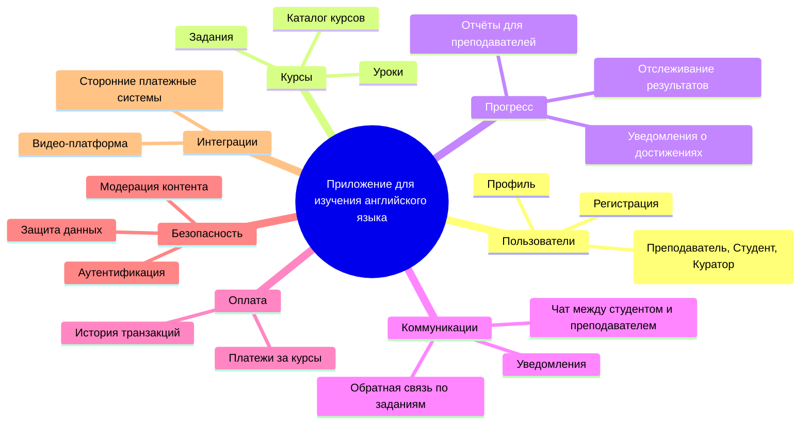
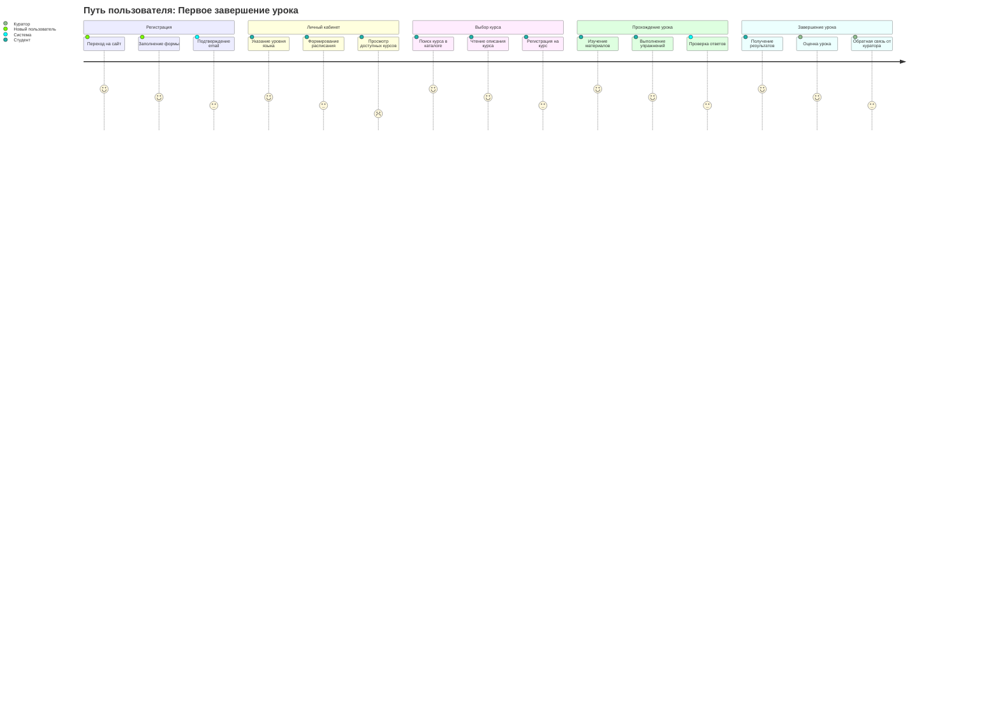
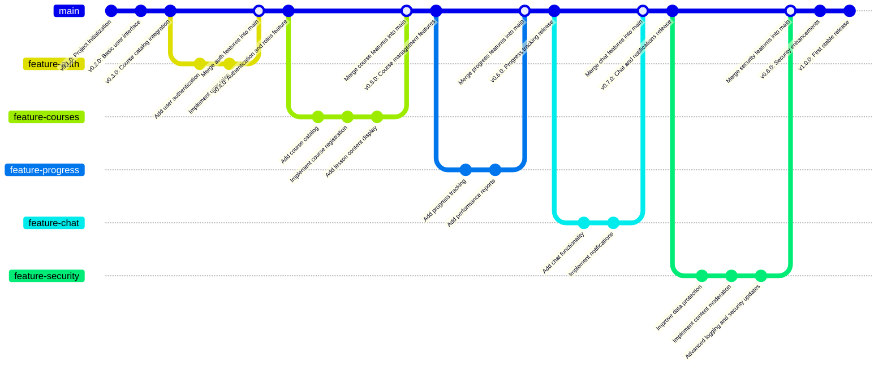

# Документирование приложения для дистанционного изучения английского языка

## 1. Структура функциональных возможностей (Mind Map)



### Описание:

Эта диаграмма иллюстрирует структуру функциональных возможностей приложения для дистанционного изучения английского языка.

### Основные узлы и их значение:

* <u>Пользователи:</u> функционал, связанный с управлением учетными записями, профилями и рейтингами.

* <u>Защита данных:</u> безопасность приложения.

* <u>Прогресс:</u> описывает процессы, связанные с успеваемость студента, включая оценки и т.д.

* <u>Коммуникации:</u> система взаимодействия между пользователями (чаты, уведомления).

* <u>Курсы:</u> основная сущность приложения, объединяющая основные темы, задания, учебные материалы.

## 2. Диаграмма путешествия пользователя (User Journey Diagram)



### Описание:

Диаграмма описывает ключевые этапы взаимодействия пользователя с системой:

* Регистрация: пользователь создает учетную запись и настраивает свой профиль.

* Личный кабинет: пользователь управляет своим профилем.

* Выбор курса: пользователь просматривает доступные курсы, используя различные фильтры и иные инструменты поиска.

* Прохождение урока: студент проходит новый урок.

* Завершение урока: пользователь-студент завершает урок, получает обратную связь от преподавателя в виде оценки, отзыва на его работу.

## 3. Квадрант-граф (Prioritization Quadrant)

```mermaid
quadrantChart

    title Priorities of Functionality Development

    x-axis Easy --> Hard

    y-axis Low Priority --> High Priority

  

    "Registration": [0.28, 0.9]

    "Course Catalog": [0.3, 0.8]

    "Lesson Content": [0.4, 0.95]

    "Student Progress Tracking": [0.6, 0.8]

    "Student-Teacher Chat": [0.5, 0.7]

    "Course Payments": [0.7, 0.9]

    "Notifications": [0.6, 0.5]

    "Achievement Badges": [0.3, 0.3]

    "Video Integration": [0.87, 0.8]

    "Authentication": [0.1, 0.9]

    "Data Protection": [0.9, 0.9]

    "Content Moderation": [0.55, 0.55]
```

### Описание:

Квадрант-граф помогает приоритизировать разработку функций системы. Каждая точка соответствует функционалу:

* Ось X: сложность реализации (от простого к сложному).

* Ось Y: приоритет для пользователей (от низкого к высокому).

## 4. Гит граф (Gitgraph)



### Описание:

 Гит-граф показывает процесс разработки системы через версии:

1. Основная ветка (main): стабильные версии системы.

2. Функциональные ветки: каждая ветка посвящена отдельной функциональности (пользователи, курсы, прогресс и т.д.).

3. Слияния: после завершения работы над веткой, изменения интегрируются в main.
